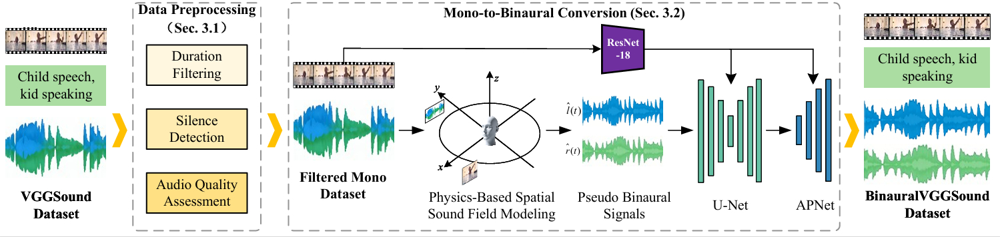
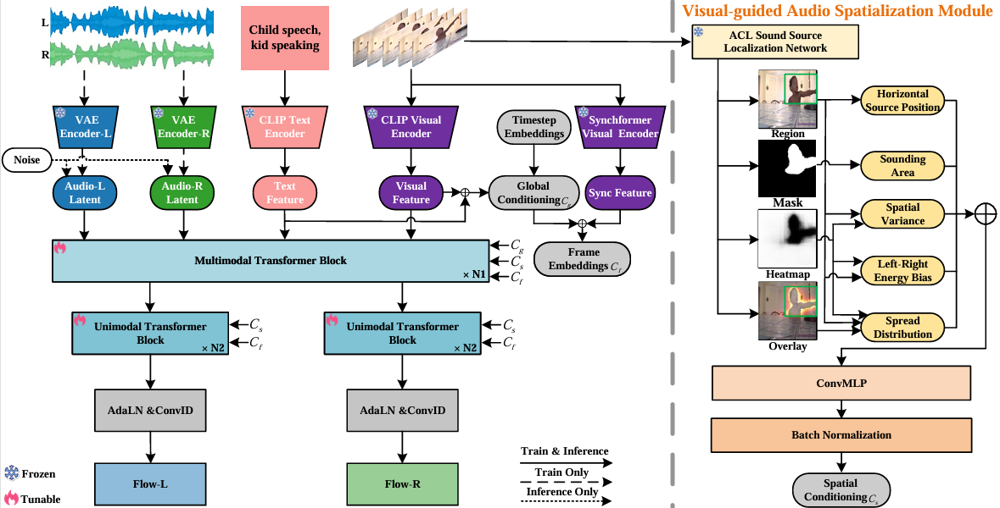

# SpatialV2A: Visual-Guided High-fidelity Spatial Audio Generation

[](https://arxiv.org/abs/2601.15017)
[]()
[]()
[](https://opensource.org/licenses/MIT)

> **Authors**: Yanan Wang, Linjie Ren, Zihao Li, Junyi Wang, Tian Gan (School of Computer Science and Technology, Shandong University)

---

## 📝 Abstract
While video-to-audio generation has achieved remarkable progress in semantic and temporal alignment, most existing studies focus solely on these aspects, paying limited attention to the spatial perception and immersive quality of the synthesized audio. This limitation stems largely from current models’ reliance on mono audio datasets, which lack the binaural spatial information needed to learn visual-to-spatial audio mappings.To address this gap, we introduce two key contributions: we construct BinauralVGGSound, the first large-scale video-binaural audio dataset designed to support spatially aware video-to-audio generation; and we propose an end-to-end spatial audio generation framework guided by visual cues, which explicitly models spatial features. Our framework incorporates a visual-guided audio spatialization module that ensures the generated audio exhibits realistic spatial attributes and layered spatial depth while maintaining semantic and temporal alignment.

---

## 🔧 Core Pipelines
### 1. Dataset Construction Pipeline

*Figure: Pipeline for constructing the large-scale BinauralVGGSound dataset*

### 2. SpatialV2A Framework Pipeline

*Figure: End-to-end visual-guided spatial audio generation pipeline of SpatialV2A*

---

## 📋 Todo List
- [ ] Release SpatialV2A framework code
- [ ] Open access to BinauralVGGSound dataset
- [ ] Publish pre-trained model checkpoints

---

## 📝 Citation
If you find our work useful for your research, please cite the following BibTeX:
```bibtex
@misc{wang2026spatialv2avisualguidedhighfidelityspatial,
      title={SpatialV2A: Visual-Guided High-fidelity Spatial Audio Generation}, 
      author={Yanan Wang and Linjie Ren and Zihao Li and Junyi Wang and Tian Gan},
      year={2026},
      eprint={2601.15017},
      archivePrefix={arXiv},
      primaryClass={cs.CV},
      url={https://arxiv.org/abs/2601.15017}, 
}
